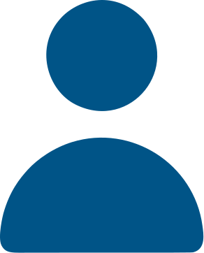
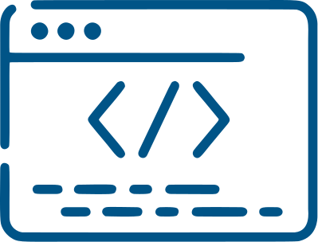
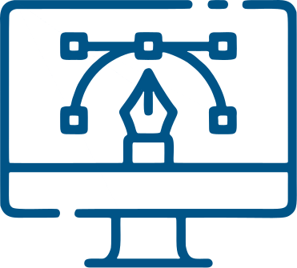
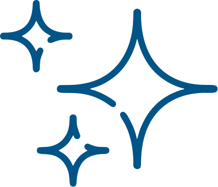
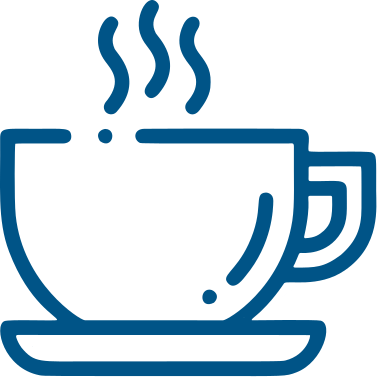
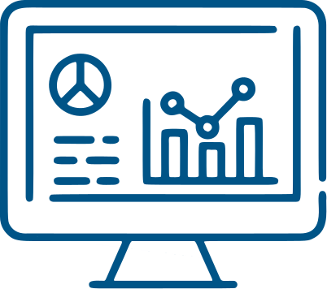

  

  

 

  
  
  

  

<h2 align="center">  Sobre mim</h2>

Eu sou a pessoa que faz a ponte entre o <b>visual bonito</b> e o <b>código que funciona</b>. Minha missão é simples: transformar ideias em <b>sites fáceis de usar e que chamam a atenção</b>.

Eu trabalho em três frentes principais:

| O que eu faço | Foco Principal | Por que isso é importante? |
|---------------|---------------|----------------------------|
| Front-end | Criar a parte do site que você vê | Para que o site seja rápido e funcione bem em qualquer tela. |
| UX/UI Design | Pensar na sua experiência | Para que usar o site seja simples, lógico e agradável. |
| Web Design | Cuidar do visual | Para que o visual do site combine com a marca e seja moderno. |

 
 

<h2 align="center">  Minhas Ferramentas Favoritas</h2>

<h3>  Para Codar (Front-end)</h3>

  
    
  
  
  
  
  
  
  
  
  
  
  

 

<h3>  Para Criar (Design e UX/UI)</h3>

  
  
  

  

 
 

<h2 align="center">  Um Pouco Mais Sobre Mim</h2>

Sou movido por <b>curiosidade</b>, <b>organização</b> e pela vontade de criar experiências digitais que realmente façam sentido para as pessoas.
Gosto de entender o <b>problema por trás do projeto</b> antes de partir para o código ou para o visual.

 

<b>Atualmente, estou focado em:</b>
<ul>
  <li>Construir interfaces <b>acessíveis, responsivas e intuitivas</b>.</li>
  <li>Aprofundar meus estudos em <b>Design Systems</b> e boas práticas de UI.</li>
  <li>Evoluir constantemente no equilíbrio entre <b>design</b> e <b>performance</b>.</li>
  <li>Manter a criatividade funcionando com um bom <b>café</b>  </li>
</ul>

 

<b>Próximos objetivos:</b>
<ul>
  <li>Dominar um framework front-end moderno como <b>React</b> ou <b>Vue</b>.</li>
  <li>Participar de projetos <b>open-source</b> que unam design e código.</li>
  <li>Colaborar em produtos digitais que tenham <b>impacto real</b>.</li>
</ul>

 
 

<h2 align="center">
  
  Estatísticas do GitHub
</h2>

  

  

  

<h2 align="center">
  
  Estatísticas do GitHub
</h2>

  

  

